# Architecture review — modgud — 2026-09-20

**Scope**: Whole tree, weighted by hot spots from the last 60 commits (`src/modgud/cli.py` 21 touches,
`src/modgud/database.py` 11, `src/modgud/web.py` 7, `src/modgud/config.py` 6, `src/modgud/digests.py` 6).
Two sub-agents walked the capture/CLI side and the web/digest/report side; findings below carry `path:line`
anchors back to the evidence.

**Picked**: `event-log-writer-seam` — see `.architecture/backlog.md`

**Degradations**: none. `gh` authenticated, sub-agents available, quality gate discovered from
`.github/workflows/ci.yml`.

**Vocabulary note**: the repo has no `CONTEXT.md` and no ADRs, so domain terms below are taken from the
code and `DESIGN.md`: an **item** is a captured piece of content, an **event** is an append-only row in
`events` recording something that happened to an item, and a **capture** is one run of `capture_url`.
Architecture terms are `codebase-design`'s: module, interface, depth, seam, adapter, leverage, locality.

**Diagram legend**: solid edges are the interface a caller must know; dashed edges are inside the
implementation.

## Candidates

### event-log-writer-seam — one writer for the append-only event log · Strong · score 23/25

- **Files**: `src/modgud/cli.py:71-238` (five `_record_*` helpers), `src/modgud/cli.py:100,160,196,214,234`,
  `src/modgud/summaries.py:209,245`, `src/modgud/audio_fallbacks.py:89,96,131,138`,
  `src/modgud/podcast_transcripts.py:228,235,312`, `src/modgud/delivery.py:190`, `src/modgud/web.py:484`,
  `src/modgud/migrations/001_initial.sql:22-34` (the table and its append-only trigger).
  New module `src/modgud/events.py` plus `tests/test_events.py`.
  **File-count estimate: 9.**
- **Score**: **23/25** (leverage 5, locality 5, blast radius 3, heat 5)
  - *Leverage 5* — 16 hand-written `INSERT INTO events` statements across 6 modules, each preceded by its own
    hand-rolled `json.dumps(..., separators=(",", ":"), sort_keys=True)`. One seam pays back at every one of
    them and removes the entire class of "spell the payload encoding again" setup.
  - *Locality 5* — today, changing how an event payload is encoded, or adding an event type, means editing a
    module and re-deriving the encoding from a neighbour. Afterwards it is a one-file edit in `events.py`.
  - *Blast radius 3* — several modules (6 source files, 1 new module, 1 new test, plus the call-site edits);
    no published interface changes. The CLI stdout contract and the HTTP routes are untouched, and the
    stored payload bytes are preserved at fifteen of the sixteen sites — see *Adjudication* for the one
    exception and why it is safe.
  - *Heat 5* — every one of the six call-site modules appears in the last 60 commits; `cli.py` is the single
    hottest file in the repo.
- **Problem**: the event log is the repo's central fact — `origin_reports.py:19-53` and `digests.py:260-271`
  both read it, `web.py:212-228` joins against it — but it has **no writer module**. Sixteen call sites each
  re-implement the same three-step prologue: build a `dict`, `json.dumps` it with a specific separator/sort
  configuration, and `INSERT INTO events (item_id, type, payload)` with the type as a SQL string literal.
  The five `_record_*` helpers in `cli.py` are the shallowest instance: `_record_caption_refusal`
  (`cli.py:201-218`) and `_record_unsummarizable` (`cli.py:221-238`) are two 18-line functions whose entire
  semantic content is the pair `('caption_refused', 'captions')` versus `('unsummarizable', 'extraction')`.
  Their interface — a connection, a keyword `item_id`, a keyword `reason` — is as complex as everything they
  do. That is shallowness by definition.

  The duplication has already drifted. `summaries.py:214-220` encodes its `summarized` payload with
  `ensure_ascii=False`; the other fifteen sites take the default and escape non-ASCII. `web.py:485` omits
  `sort_keys` entirely. Nothing in the tree states which is correct, because nothing owns the decision.

  There is a second, quieter cost: none of the sixteen sites commits, and none says it does not.
  `summarize_item` (`summaries.py:119-250`) and every `_record_*` helper are fragments that are only correct
  inside a caller's `with connect(...)` block, and neither their signatures nor their docstrings say so.
  A writer seam is where that contract can finally be written down.
- **Deletion test**: delete the five `_record_*` helpers and complexity **concentrates** — the payload shapes
  and event-type literals move into one module that owns the `events` table, rather than dispersing back to
  their callers. Delete the seam afterwards and it disperses again to sixteen places. Concentrates. Passes.
- **Solution**: add `src/modgud/events.py` owning the append-only event log: an `EventType` enumeration of
  the ten literals currently spelled as bare SQL strings, and one `record_event(connection, item_id,
  event_type, fields)` writer that performs the canonical encoding and the insert. Replace the five `cli.py`
  helpers and the eleven other call sites with calls to it. Payload bytes are preserved exactly at every
  site; the refactor is a pure re-seating of where the encoding lives.
- **Benefits**:
  - *Leverage*: a caller that wants to record something learns one function and one enumeration instead of a
    SQL string, a JSON configuration, and the table's column order.
  - *Locality*: the answer to "how is an event payload encoded?" and "what event types exist?" becomes one
    file. Today those questions are answered by reading six.
  - *Test surface*: the event log gets a `tests/test_events.py` that exercises encoding and the append-only
    trigger directly through the interface. Today the only way to assert on event writing is to stand up a
    capture — 22 of `tests/test_cli.py`'s capture tests do it by `subprocess.run(["modgud", ...])` against a
    live `ThreadingHTTPServer` (`tests/test_cli.py:140-193`), because `capture_url` has no injectable seams.
    The encoding is currently pinned only incidentally, by 39 assertions that read `FROM events` across 8
    test files.

**Before**

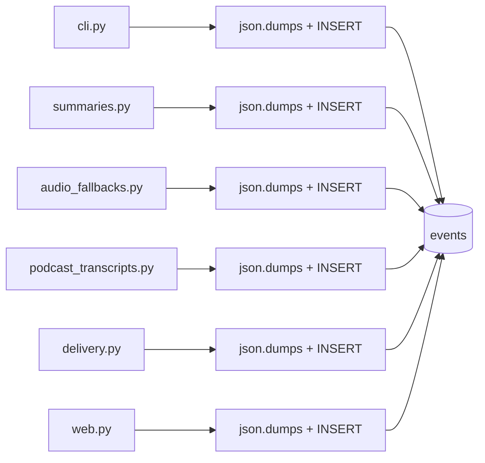

**After**

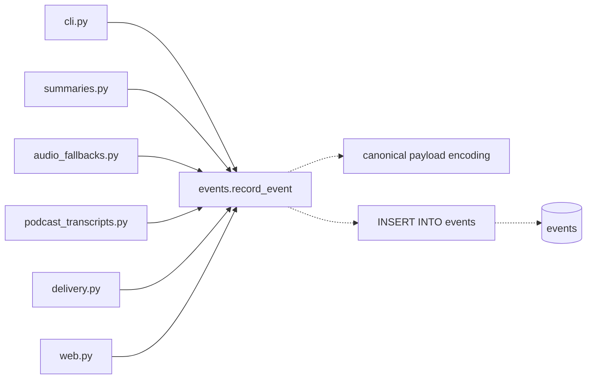

---

### capture-extraction-outcome-record — name the 13-field record `capture_url` threads · Worth exploring · score 22/25

- **Files**: `src/modgud/cli.py:333-345` (the sentinel block), `:346-391` (four disjoint writers),
  `:393-402` and `:488-537` (two readers, 140 lines downstream), `tests/test_cli.py`.
  **File-count estimate: 3.**
- **Score**: **22/25** (leverage 4, locality 4, blast radius 1, heat 5)
  - *Leverage 4* — one deeply-nested caller stops threading an anonymous record; it does not pay back at
    other call sites, so it cannot reach 5.
  - *Locality 4* — adding an extraction format becomes an edit in one place instead of four disjoint branches
    plus two downstream readers.
  - *Blast radius 1* — contained to `cli.py` and its test; no published interface changes.
  - *Heat 5* — `cli.py` is the hottest file in the repo.
- **Problem**: `capture_url` declares thirteen `None` sentinels in one block at `cli.py:333-345`
  (`extracted_text_hash`, `title`, `author`, `channel`, `chapters`, `extracted_site`, `extraction_error`,
  `extraction_error_stage`, `unsummarizable_reason`, `extracted_text`, `caption_language`, `caption_kind`,
  `duration_seconds`), fills a different subset of them in each of four mutually exclusive extraction
  branches, then reads them twice — at `:393-402` to derive `item_state`, and again at `:488-537` to choose
  which recorder to call. Three of the thirteen are set only on the YouTube branch and consumed 140 lines
  later. This is an extraction-outcome type with no name and no type.
- **Deletion test**: concentrates. Naming the record moves the "which fields does a YouTube extraction
  produce?" question out of the reader's head and into one declaration.
- **Solution**: a frozen dataclass per extraction outcome (or one with an explicit discriminant), returned by
  each branch and consumed by the two readers.
- **Benefits**: *locality* — the four branches become four constructors; *test surface* — the state-derivation
  logic at `:393-402` becomes testable without running a capture.

**Before**

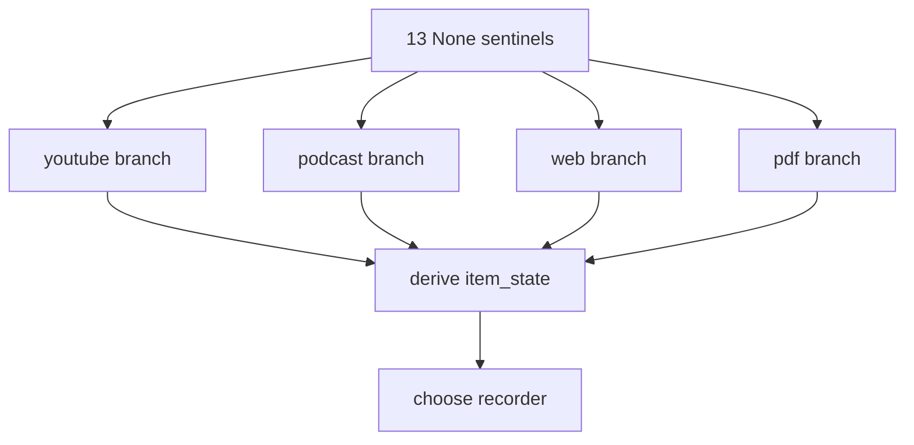

**After**

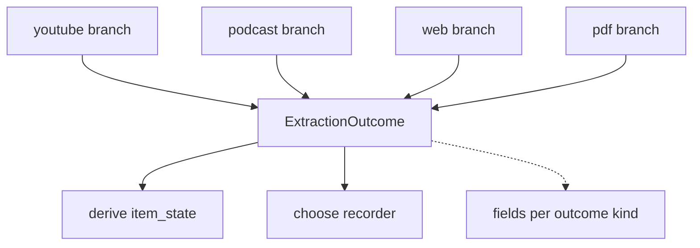

---

### label-token-typed-errors — stop discriminating failures by message text · Worth exploring · score 21/25

- **Files**: `src/modgud/label_tokens.py:17-97`, `src/modgud/web.py:167-189`, new `tests/test_label_tokens.py`.
  **File-count estimate: 3.**
- **Score**: **21/25** (leverage 4, locality 5, blast radius 1, heat 3)
  - *Leverage 4* — only two call sites, but it removes a whole class of test setup: the module's error
    contract currently costs 28-37 lines of scaffolding per assertion.
  - *Locality 5* — the failure taxonomy becomes one declaration instead of a message string in one module and
    a string comparison in another.
  - *Blast radius 1* — three files, no published interface changes.
  - *Heat 3* — `label_tokens.py` landed in #65 and has not moved since; `web.py` is hot.
- **Problem**: `validate_label_token` (`label_tokens.py:56-97`) signals five distinct outcomes, only one of
  which has a type (`ExpiredLabelToken`, `:17`). The other four are all `InvalidLabelToken`, discriminated
  **only by their message text** — `"malformed token"`, `"invalid signature"`, `"malformed payload"`,
  `"wrong item"`, `"wrong label"`. `web.py:180-188` then rebuilds user-facing copy by string-comparing the
  exception: `if str(error) == "wrong item"`. Renaming that literal at `label_tokens.py:92` silently
  downgrades the page served at `web.py:182` to a generic fallback — no type error, no import to follow.
  There is no `tests/test_label_tokens.py`: the 96-line module's error contract is pinned by exactly three
  assertions in web tests (`tests/test_web.py:360,403,445`), each of which first builds a nine-field
  `DigestItem`, renders a full HTML email, and **regex-scrapes an `href` out of it**
  (`tests/test_web.py:97-131`) — because the URL assembly lives in the private `digests._label_link`.
- **Deletion test**: concentrates. One exception hierarchy replaces a set of strings crossing a module seam.
- **Solution**: one exception class per failure mode (or a typed discriminant on `InvalidLabelToken`), and a
  direct unit test file for the module.
- **Benefits**: *leverage* — the caller matches on types the type-checker enforces; *test surface* — five
  outcomes become five cheap unit tests instead of three expensive integration ones.

**Before**

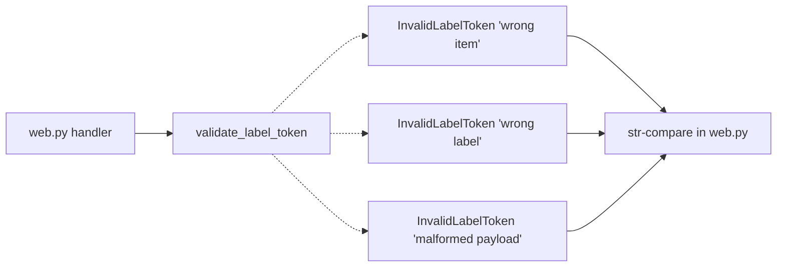

**After**

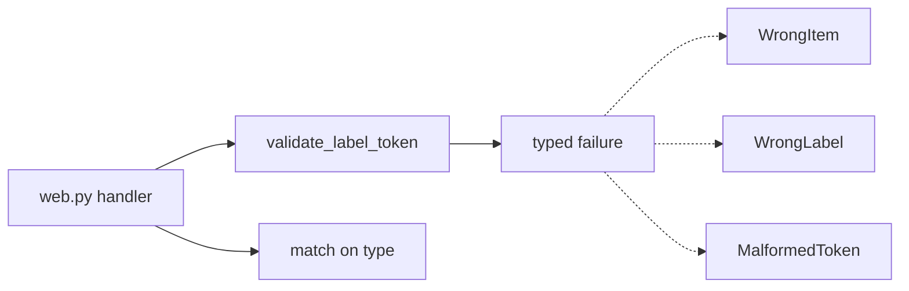

---

### workspace-paths-seam — one module owns where the data lives · Worth exploring · score 20/25

- **Files**: the literal `"modgud.sqlite3"` at `src/modgud/cli.py:253,562,580,586,600,727,736,750,756,782` and
  `src/modgud/web.py:110`; `BlobStore(data_dir / "blobs")` at `src/modgud/cli.py:326,589,603,725` and
  `src/modgud/web.py:111`. **File-count estimate: 6.**
- **Score**: **20/25** (leverage 4, locality 4, blast radius 3, heat 5)
- **Problem**: there is no module that knows the shape of a data directory. `data_dir` is a `Path` that
  eleven call sites unpack by hand, re-deriving the database filename and the blob root each time.
  The same absence shows up in connection lifetime: `grep -rn '\.commit()' src/` returns **zero** hits, so
  every one of the 25 `with connect(...)` sites relies on `sqlite3.Connection.__exit__` committing —
  which it does — while none of them relies on it closing, which it does not. Closure is left to refcounting.
- **Deletion test**: concentrates, weakly. A `Workspace` that hands out a connection and a blob store puts
  the layout and the connection contract in one place.
- **Solution**: a module owning the data-directory layout and the connection context manager.
- **Benefits**: *locality* — moving the database file, adding a busy timeout, or closing deterministically
  becomes a one-file edit.

**Before**

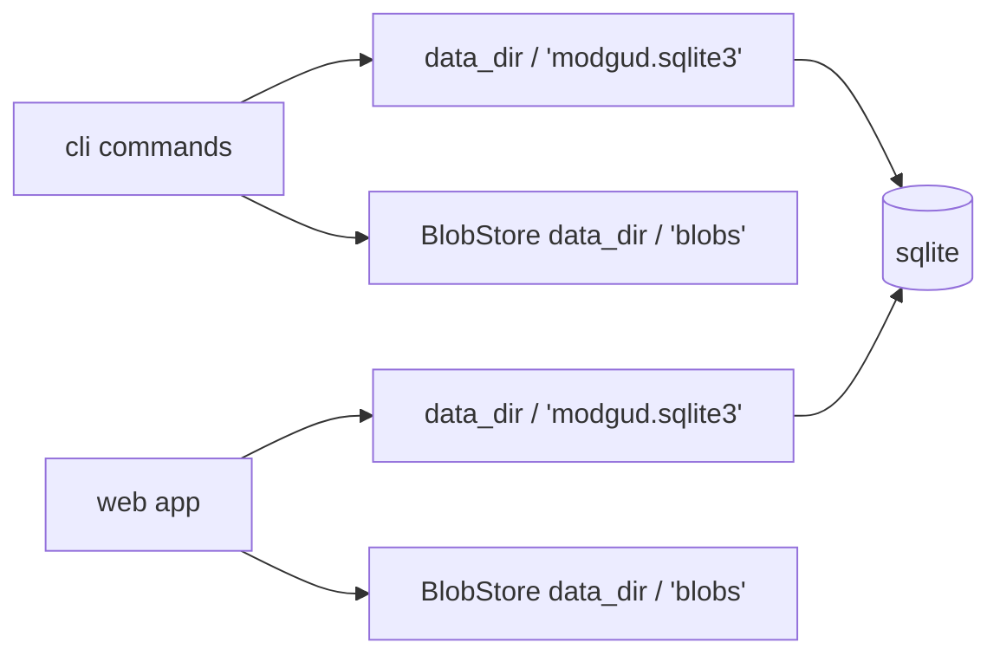

**After**

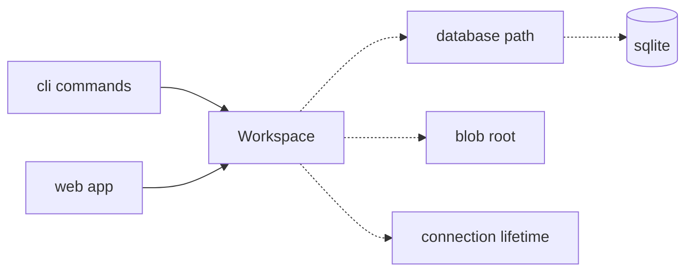

---

### web-item-lookup-seam — one way to look an item up for display · Worth exploring · score 20/25

- **Files**: `src/modgud/web.py:208,212-228,293-299,374-380,405,445-449,474-478`; the duplicated route bodies
  at `:435-462` and `:464-494`. **File-count estimate: 4.**
- **Score**: **20/25** (leverage 4, locality 4, blast radius 2, heat 4)
- **Problem**: six single-item lookups with five distinct column lists, and `coalesce(title, canonical_url)`
  written out five times (`:214,294,375,446,475`). `confirm_label` and `record_label` are byte-identical for
  eighteen lines and have **already drifted**: the `if item is None` check sits outside the `with` block at
  `:452` and inside it at `:481`. `SELECT format, extracted_text_hash, chapters FROM items WHERE id = ?`
  appears verbatim in three further modules (`summaries.py:128`, `span_maps.py:196`,
  `long_form_summaries.py:38`), each unpacking into the same three names.
- **Deletion test**: concentrates.
- **Solution**: one lookup returning a named item projection, shared by the routes that display an item.
- **Benefits**: *locality* — the display projection stops being re-derived per route; the drift between the
  twin routes becomes impossible to express.

**Before**

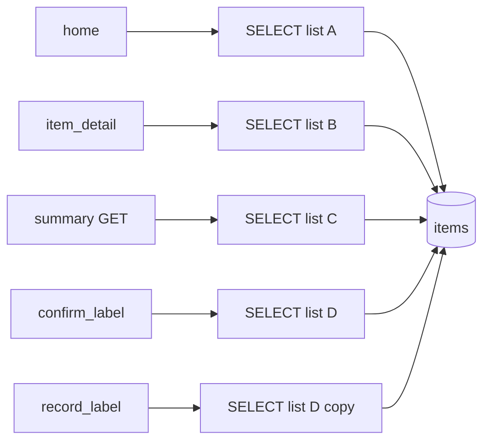

**After**

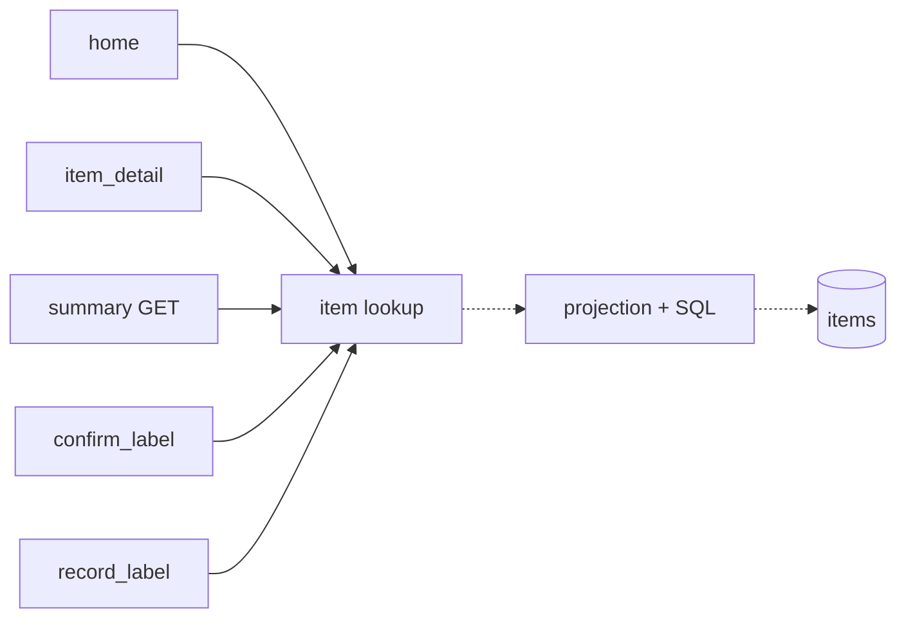

---

### named-row-access — give database rows names instead of ordinals · Speculative · score 17/25

- **Files**: 34 lines carrying 41 positional reads across `digests.py` (15), `web.py` (10),
  `origin_reports.py` (6), `cli.py` (4), `inbound.py` (4), `time_to_value.py` (2); plus 7 more inside Jinja
  templates (`templates/confirm_label.html:8`, `templates/label_recorded.html:8`, `templates/index.html:20-21`).
  **File-count estimate: 14.**
- **Score**: **17/25** (leverage 4, locality 3, blast radius 4, heat 4)
- **Problem**: no `row_factory` is set anywhere in `src/` or `tests/`, so every database read is by ordinal.
  `origin_reports.py:72-76` reads `row[1]`..`row[4]` as four `int(...)`s — `item_count`, `worth_it`,
  `not_worth_it`, `unlabelled`. Transposing indices 2 and 3 inverts the report's entire ranking
  (`origin_reports.py:135`) and every "X% not worth it" string (`:144`) while raising nothing. `web.py:233-242`
  reads eight indices of which five are interchangeable strings. Three templates index raw sqlite tuples
  from inside HTML, beyond the type-checker's reach entirely.
- **Deletion test**: this one is closer to *moves* than *concentrates* — `sqlite3.Row` names the columns but
  the projection knowledge stays spread across the same modules. Hence locality 3.
- **Solution**: `row_factory = sqlite3.Row` plus named access; templates receive mapped objects.
- **Benefits**: *leverage* — a class of silent transposition bugs becomes impossible; but the blast radius
  crosses into templates, which the type-checker does not see, so a single unattended PR cannot verify it all.

**Before**

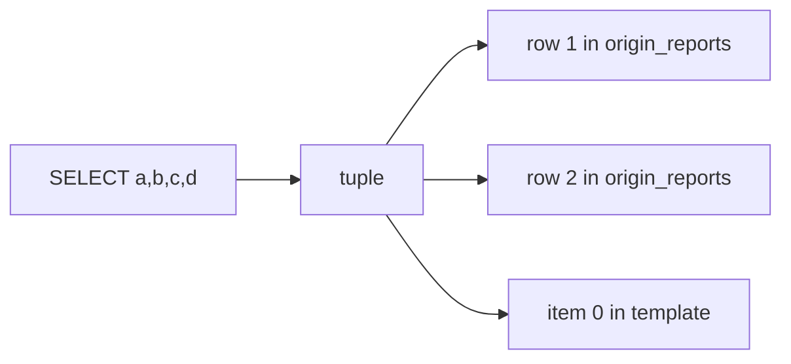

**After**

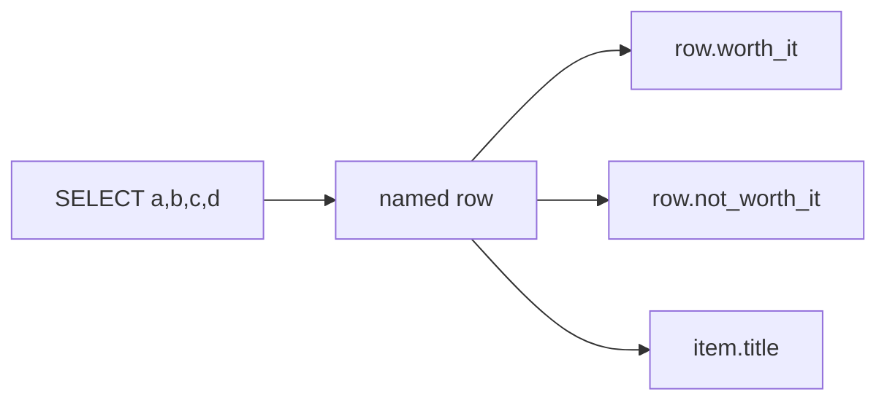

## Dropped

| Candidate | Dropped because |
|---|---|
| `time-to-value-sort-key-removal` | Leverage 1 — `time_to_value_sort_key` (`time_to_value.py:12-14`) has zero production callers and is pinned only by `tests/test_time_to_value.py:12,63`; the ordering it encodes is independently re-spelled as SQL at `digests.py:288-290`. Deleting it removes dead code but concentrates nothing, so it fails the deletion test as a *deepening*. Worth a tidy-up commit by a human; not a candidate here. |
| `digest-span-map-query-count` | Leverage 2 — `digests.py:308` calls `get_span_map`, which issues two queries per row (`span_maps.py:163-184`), making digest selection `1 + 2N` queries inside `delivery.py:139`'s `BEGIN IMMEDIATE`. Real, but it is a query-count problem *inside* an existing seam; fixing it does not change any interface, so it is a performance fix rather than a deepening. |
| `error-response-wrapper-collapse` | Leverage 2 — `label_error` (`web.py:137-142`) and `item_error` (`:144-149`) are 6-line pass-throughs to `_error_response` (`:127-135`) differing by one string literal. Collapsing them shrinks the interface but callers do exactly the same work, and the status codes stay ad hoc at each of the 13 call sites. Cosmetic. |
| `strftime-timestamp-literal` | Leverage 2 — `strftime('%Y-%m-%dT%H:%M:%fZ', 'now')` appears 26 times across `src/modgud/`, but the great majority are `DEFAULT` clauses in the eleven migration files, which are immutable history and must not be edited. The handful of Python-side occurrences are not enough to justify a seam. |

## Too large to automate

| Candidate | Why |
|---|---|
| `capture-url-pipeline-decomposition` | Blast radius 5. `capture_url` (`cli.py:241-558`) is 318 lines, 55 branches, 42 distinct locals and 5 return paths — 40% of `cli.py` in one function. It opens **three** connections (`:254`, `:417`, `:548`) with three independent commit points, so a failure in the summarize phase cannot undo the item row committed at `:543`. It performs four `blob_store.put` calls (`:327,358,376,389`) *before* the write transaction opens, and two return paths (`:419-422`, `:433-453`) abandon those bytes on disk. Its pre-fetch dedupe read at `:259-262` runs under no explicit transaction and is re-checked under `BEGIN IMMEDIATE` at `:423-432` one or two network fetches later. No test imports it: 22 of its tests shell out via `subprocess.run(["modgud", ...])`. Decomposing it means re-deciding three transaction boundaries and the CLI's stdout contract in one diff — that is a human-scheduled program of work, not one unattended PR. Two of its sub-problems *are* separately automatable and are scored above as `capture-extraction-outcome-record` and `event-log-writer-seam`. |
| `blob-orphan-reaper` | Blast radius 5 and, more decisively, it is a new subsystem rather than a deepening. Six call sites pair a `blob_store.put` with a later row write across a transaction boundary (`cli.py:327,358,376,389`, `audio_fallbacks.py:104`, `podcast_transcripts.py:197`), and no garbage collection of `blobs/` exists anywhere in `src/`. Bounded severity — `BlobStore.put` is content-addressed and idempotent (`blobs.py:15-40`), and `items.content_hash` is `NOT NULL UNIQUE`, so the failure mode is orphaned bytes, never a dangling reference — but designing a reaper is a feature, and features are not this skill's remit. |

## Pick

**`event-log-writer-seam`, 23/25.**

The runner-up **candidate** is `capture-extraction-outcome-record` at 22/25 — **within one point**, so the
pick was close and the runner-up is the natural next firing. The two differ almost entirely on reach: both
name something the code currently leaves anonymous, but the outcome record pays back inside one function
(leverage 4, blast radius 1) while the event writer pays back at sixteen call sites in six modules
(leverage 5, blast radius 3). The rubric doubles leverage precisely to prefer the wider payback, and the
inverted blast-radius term is not enough to close a two-point leverage gap.

Two further points favoured the pick on the evidence rather than the arithmetic. First, the event log is
already read by three modules (`origin_reports.py`, `digests.py`, `web.py`) and written by six, so it is the
one concept in this tree whose absence of an owning module is felt from both sides. Second, its duplication
has **measurably drifted** — `summaries.py:214` encodes with `ensure_ascii=False` and the other fifteen sites
do not, `web.py:485` drops `sort_keys` — which is the signal that a seam is overdue rather than hypothetical.
The outcome record is, by contrast, still internally consistent; it is friction, not yet drift.

`capture-extraction-outcome-record` is also partly *unblocked* by this pick: with the recorder helpers behind
one writer, the second reader of the thirteen sentinels (`cli.py:488-537`) shrinks to a dispatch over event
types, which makes naming the record a smaller and safer next change.

## Design

Four interfaces were produced in parallel by sub-agents, each briefed to commit to a radically different
direction and to be honest about what its direction is bad at. All four are recorded here before
adjudication, so the verdict is made against the written designs rather than against memory.

**A correction all four designs surfaced independently**: the `events` table carries **ten** event types,
not eleven. `pending` belongs to `tier_2_summaries.status` (`long_form_summaries.py:127`), a different
table. Verified directly: `captured`, `extracted`, `failed`, `caption_refused`, `unsummarizable`,
`summarized`, `audio_fallback`, `podcast_transcript`, `digest_sent`, `label`. The candidate card above has
been corrected.

**A constraint all four converged on**: the encoding drift can be resolved either way without breaking a
test. All 39 `FROM events` assertions decode through `json.loads`, `json_extract`, `count(*)`, or read
`type` alone; the only raw-payload string comparisons (`tests/test_database.py:220,290`) compare against
literals the test itself inserted. `web.py:485`'s missing `sort_keys` is a no-op because its payload has one
key. So the only live question is `ensure_ascii`, and the log is append-only, so old rows keep whatever form
they were written with either way.

### Design A — minimal surface

**Interface**: one public name.

```python
def record(
    connection: sqlite3.Connection,
    item_id: int,
    event_type: str,
    /,
    **fields: object,
) -> None:
```

Positional-only parameters are load-bearing rather than stylistic: with `**fields` absorbing the payload,
a field named `connection` or `item_id` would otherwise collide with a parameter.

**Usage**: `events.record(connection, item_id, "label", label=label)` replaces four lines at `web.py:484`.
Three of the five `cli.py` helpers are deleted outright; `_record_capture` and `_record_extraction` survive
as thin field-assembly helpers because their conditional fields still have to be assembled somewhere.

**Hides**: the table name and column order, that the payload is JSON text, the serialisation dialect, and
that the log is append-only (no update or delete is offered).

**Dependency strategy**: `sqlite3` stays visible in the signature deliberately. One adapter, so the
`events ↔ sqlite3` boundary is a hypothetical seam and is correctly not abstracted. The real seam is
`events ↔ callers`.

**Drift verdict**: `ensure_ascii=False` everywhere, on the grounds that it is the only *deliberate* choice
in the tree — `summaries.py:214`, `cli.py:169`, `cli.py:351` all type it, while the fourteen defaulting
sites inherited a default nobody chose.

**Its own stated weaknesses**: no static check on the event type (`"labels"` typechecks) and none on field
names (`reasan=reason` typechecks) — which is *strictly worse* than the three `cli.py` helpers being
deleted, whose keyword-only signatures did give mypy something to check. `delivery.py:174-195` is the
worst-served caller: its conditional `**{...} if ... else {}` splat has to move inside an argument list and
reads worse than what it replaced. Five conditional callers keep building dicts, so leverage there is ~6
lines out of 25 rather than 18 out of 23.

**Blast radius**: 8 files, no test files edited, net line count down.

### Design B — typed event values

**Interface**: twelve frozen dataclasses (one per payload shape — note *twelve*, because `extracted` and
`failed` each have two distinct real shapes), a `Literal` alias per closed vocabulary, an `Omittable[T]`
alias with an `OMITTED` sentinel, and one writer.

```python
type Omittable[T] = T | Absent          # T, or no key at all — distinct from T | None, which stores null
def record(connection, item_id: int, event: Event, *rest: Event) -> None:
```

The central mechanism is that **omission is a type, not a convention**. The existing code needs both
behaviours in one payload: `_record_capture`'s `origin` is `str | None` and is always written (including as
`"origin":null`, which `tests/test_inbound.py:501` asserts and `origin_reports.py:12` reads via
`json_type`), while `fetch_error` is `str | None` and is dropped when absent. A blanket drop-`None` encoder
would silently break `origin`.

**Hides**: everything A hides, plus the payload key names, the omit-versus-null rule, and the event-type
strings. `mypy --strict` rejects a missing field, a typo'd field, and a wrong `Literal`.

**Drift verdict**: `ensure_ascii=False`, same reasoning as A.

**Its own stated weaknesses**, stated frankly by its author: net line count in `src/` is **+10** — this
design does not shrink the codebase, and "anyone selling this as a line reduction is wrong". Twelve exported
names for a ~20-line implementation; by its own assessment the module is "wide and shallow-ish", with its
value in compile-time enforcement rather than hidden complexity. `payload()` uses `dataclasses.fields()` +
`getattr`, so **Python field names silently become the wire format** — renaming `Captured.origin` changes
the stored key and breaks `origin_reports.py`'s `json_extract(payload,'$.origin')` with no type error
anywhere, which is a new silent-failure class. The `feed_url`/`guid` both-or-neither invariant is lost and
paid for with a duplicated ternary pair at two call sites. Two classes per SQL type breaks the 1:1 mental
model.

**Blast radius**: 8 files, but drags two non-mechanical changes outside the event-writing lines — retyping
`web.py:48-51`'s `_LABEL_NAMES` to `dict[LabelName, str]` (touching a handler that writes no event at all),
and annotating `cli.py:340`'s `extraction_error_stage` to close the failure-stage vocabulary.

### Design C — an item-bound log

**Interface**: one class bound to `(connection, item_id)`, with one method per event type.

```python
class ItemLog:
    def __init__(self, connection: sqlite3.Connection, item_id: int) -> None: ...
    def captured(
        self,
        *,
        url,
        canonical_url,
        origin,
        inbound_message_id=None,
        fetch_error=None,
        podcast=None,
    ) -> None: ...
    def unsummarizable(self, reason: str) -> None: ...

    # ... ten methods, one per event type
```

Shaped around the dominant write: *"I am inside a transaction, I have one `item_id`, and I am about to
append one or two events about it."* Three call sites write two events in a row to the same item
(`audio_fallbacks.py:89+96` and `131+138`, `podcast_transcripts.py:228+235`), and `capture_url` makes eight
recorder calls that all re-pass the same connection and item id.

**Usage**: `capture_url` needs **3 `ItemLog` constructions to serve 8 recorder calls**, eliminating 16
re-passed arguments; `log.failed(error=..., stage=...)` and `log.unsummarizable(reason)` drop from six-line
and five-line calls to one line each. The five `cli.py` helpers (106 lines) are deleted; `cli.py` goes
796 → ~680. `import json` leaves `audio_fallbacks.py` and `web.py` entirely.

**Hides**: everything A hides, plus the payload key names, the omit-if-None rule, the embedded constants
(`log.unsummarizable(reason)` hides both the `'unsummarizable'` literal *and* `stage: "extraction"`), the
ten-type vocabulary (discoverable by autocompleting `log.`), and that `item_id` must be repeated.

**Dependency strategy**: concrete `sqlite3.Connection`, one adapter, hypothetical seam, deliberately not
abstracted — same verdict as A and B. One `Protocol` is used, `PodcastIdentity`, and not for
substitutability: it inverts a dependency (so `events.py` need not import `podcasts.py`) and keeps the
`feed_url`/`guid` pair together so a half-populated `captured` payload is unrepresentable — the exact
invariant Design B admits it loses.

**Drift verdict**: `ensure_ascii=False`, plus a `backslashreplace` guard present at none of the sixteen
sites. `cli.py:64` decodes fetched bytes with `surrogateescape`, and a lone surrogate reaching
`json.dumps(..., ensure_ascii=False)` makes `sqlite3` raise `UnicodeEncodeError` on binding — where today's
fourteen `ensure_ascii=True` sites would have escaped it harmlessly. The guard re-escapes only unencodable
code points, so the single encoder is as robust as the safest current site.

**Its own stated weaknesses**: the sharpest is that **object lifetime versus transaction lifetime fails
silently**. `sqlite3.Connection.__exit__` commits but does not close, and the repo never closes connections,
so an `ItemLog` that outlives its `with connect(...)` block does not raise — it writes into a fresh implicit
transaction nobody will commit, and the row is lost with no error. The shape invites the mistake, because
`audio_fallbacks.py:55` opens its `with` inside a per-item loop where `item_id` is already in scope above
it. Mitigation is three docstring rules, which is convention, not enforcement. Second: `digest_sent` is not
an item event at all — `delivery.py:193` staples it to `item_ids[0]` — so an item-bound object forces the
caller to name an item to log a fleet-level fact. Third: one-off callers (`web.py`, `delivery.py`) pay a
throwaway-object idiom whose amortisation premise does not apply to them.

**Blast radius**: 8 files, 0 test files edited, 16 `INSERT INTO events` in `src/` → 1.

### Design D — ports and adapters

**Interface**: an `EventLog` `Protocol` (`append`, `events_for`, `latest`), a `SqliteEventLog` adapter, and
an `EventLogSessions` factory.

Recorded here because its negative verdict is the useful part, and its author reached it unprompted:

> **The seam is hypothetical.** One adapter, five extra tables dragged in to keep atomicity, two leaked
> implementation details, a read half with zero production callers, and a test surface that hides all three
> of the table's real invariants.

The specifics are worth keeping, because they are the reason nobody should retry this direction here:

- **Atomicity forces the port to grow into a datastore port.** All six writer modules write something else
  in the same transaction — `items`, `postmark_inbound_messages`, `tier_1_summaries`, `digest_schedule`.
  An `EventLog`-only port cannot express `audio_fallbacks.py:118-145`'s `UPDATE items` landing or failing
  with its two event writes. The port preserves atomicity only by covering five more tables.
- **A composition root cannot own the adapter's lifetime.** `database.py:23` opens connections without
  `check_same_thread=False`, and `web.py:278` calls `capture_url` on a threadpool worker via
  `run_in_threadpool`. A connection-backed adapter constructed in `create_app` would raise
  `ProgrammingError` when it crossed that boundary. The only constructible adapter is one bound to a path —
  which is `connect(database)` with a wrapper around it.
- **`BEGIN IMMEDIATE` leaks through the port.** Four sites (`cli.py:256,418`, `delivery.py:139`,
  `inbound.py:279`) take the write lock explicitly. A `transaction()` that hides the connection must name a
  SQLite locking mode in its own signature.
- **The read half has no production callers.** All four readers are analytic SQL joining `events` to
  `items` — window functions in `origin_reports.py:9-53`, a `max(id)` watermark in `digests.py:255-293`.
  None is expressible as `events_for(item_id)`; behind a port each would become a method whose only possible
  implementation is that exact SQL, an interface as complex as what it hides.
- **The in-memory fake does not count as a second adapter.** The three properties the table actually
  guarantees — the `ON DELETE RESTRICT` foreign key, the `json_valid(payload)` CHECK, and the append-only
  triggers — are SQLite's and are unreproducible in a list of dataclasses. A fake that cannot fail the way
  production fails is a test double, not an adapter.
- Where a port *is* right in this repo: `delivery.EmailClient` (`delivery.py:64-67`), which has a real
  Postmark adapter and a real recording double, on a genuine process boundary. That is what two adapters
  looks like.


### Adjudication

Criteria, applied in order: **depth**, **locality**, **seam placement**, **test surface**, **blast radius**.
An advisor reviewed the four written designs against them.

**Winner: Design C, the item-bound `ItemLog` — with the encoding decision taken from Design D.**

- **Depth** — C is the only design where a caller learns one name and receives the ten-type vocabulary by
  autocompleting `log.`. `log.unsummarizable(reason)` hides the `'unsummarizable'` literal *and* the embedded
  `stage: "extraction"`. A has the smallest interface but hides the least: the event-type string and the
  payload key names stay tribal knowledge at the call sites, and five conditional dict-builders stay put.
  B exports twelve names over a ~20-line implementation and its own author classifies it as "wide and
  shallow-ish" — that is criterion 1 failing by self-report.
- **Locality** — B and C both concentrate the key names and the omit-if-None rule; A does not. B is then
  set back by its own mechanism: `dataclasses.fields()` + `getattr` makes Python field names the wire
  format, so renaming `Captured.origin` changes the stored key and breaks
  `origin_reports.py`'s `json_extract(payload,'$.origin')` with no type error anywhere. That is a *new*
  delocalised failure introduced by the fix. C builds each payload dict explicitly, so renaming a parameter
  does not move a key.
- **Seam placement** — A, B and C tie: all three put the seam at `events ↔ callers`, where sixteen callers
  genuinely vary, and all three decline to abstract `events ↔ sqlite3`, where nothing varies. D
  self-eliminates on this criterion, by its own author's verdict.
- **Test surface** — B and C are close; both pin every payload shape through the interface. C edges it
  because its shapes are explicit rather than reflected. B's golden key-set test is load-bearing precisely
  *because* of the reflection hazard, which is a worse position to be in than not needing it.
- **Blast radius** — a tie-break only, and the first four criteria had already settled it. It confirms
  rather than decides: C is 8 files with no test files edited and a net reduction; B is 8 files at roughly
  +10 net lines plus two non-mechanical drags outside the event-writing lines.

**The runner-up design is B (typed event values)**, losing on depth (twelve exported names over a twenty-line
implementation) and on trading one delocalised failure for another (field names silently becoming wire
format). Its `Omittable[T]` insight is nonetheless the sharpest thing any of the four produced, and C
reproduces the behaviour it names — omission versus `null` — through explicit per-method dict construction.

#### One change against all four designs: keep `ensure_ascii` at its default

All four sub-agents independently converged on `ensure_ascii=False`. That consensus is not adopted, for
three reasons:

1. **The candidate was scored on preserving stored bytes.** `ensure_ascii=False` changes the rendering at
   fourteen sites; leaving the default changes it at one (`summaries.py:214`). There is no zero-change
   option, so the smaller diff wins.
2. **The autonomy contract forbids changing a stored format beyond what the picked candidate strictly
   requires.** Collapsing sixteen duplicated writers does not require re-deciding the encoding. As Design
   D's author observed, being able to flip it later in one line *is* the payoff of the seam — not something
   to spend now, before a human has reviewed the seam itself.
3. **The default is strictly more robust here, which is the opposite of what three designs assumed.**
   `cli.py:64` decodes fetched bytes with `surrogateescape`, so a lone surrogate can reach a payload field.
   Verified directly against the project toolchain:

   ```
   json.dumps({"error": "\udc80bad"}, ensure_ascii=False)  → binds:  UnicodeEncodeError
   json.dumps({"error": "\udc80bad"})                      → binds:  OK  ('{"error":"\\udc80bad"}')
   ```

   `ensure_ascii=False` would therefore turn a survivable capture failure into an unhandled exception at the
   sqlite binding, at fourteen sites that are safe today. Taking the default also makes Design C's proposed
   `backslashreplace` guard unnecessary — it existed only to patch a hazard that `ensure_ascii=False`
   introduces.

   The corresponding equivalence was also verified, so the one site that *does* change is safe:
   `json_extract` and `json_type` return identical results for `'{"o":"café"}'` and `'{"o":"café"}'`.

So the canonical encoding is `json.dumps(fields, separators=(",", ":"), sort_keys=True)` — the fourteen-site
majority, now stated once. `web.py:485`'s missing `sort_keys` is a no-op on its single-key payload, so that
site is byte-identical; `summaries.py:214`'s `summarized` payload is the only site whose bytes change, and
only when a summary contains non-ASCII text.

#### Two objections considered and not treated as blocking

- **`ItemLog` lifetime versus transaction lifetime.** C's author flags that an `ItemLog` outliving its
  `with connect(...)` block would write into a transaction nobody commits, losing the row silently. The
  hazard is real but bounded: `ItemLog(connection, item_id)` requires `connection`, which only exists once
  the `with` statement has bound it, so the object cannot be hoisted above the block. The remaining failure
  mode is deliberately storing or returning one, which the class docstring forbids. A and B carry the same
  hazard in a different shape — a `record(connection, ...)` call placed after the `with` exits is equally
  silent.
- **`digest_sent` is not an item event.** `delivery.py:193` staples it to `item_ids[0]`. An item-bound
  object forces the caller to name an item in order to record a fleet-level fact. C's own framing is
  accepted: this makes an existing data-model wart louder rather than papering over it. The behaviour is
  preserved verbatim and the wart is left for a human.
